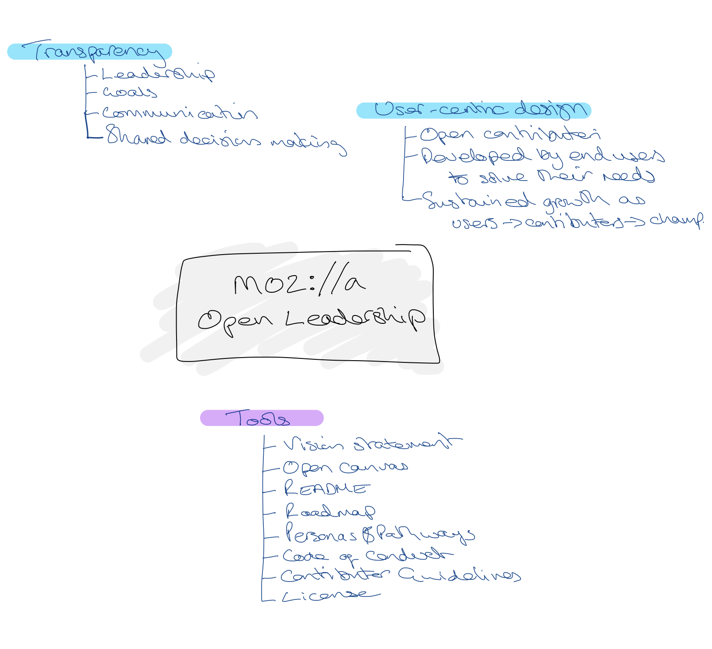

# Launching the program
We will launch the ambassador program at a WIN Wednesday Seminar on 16th September. Event details and joining instructions will be listed on the [WIN Intranet](https://sharepoint.nexus.ox.ac.uk/sites/NDCN/FMRIB/Lists/Calendar/DispForm.aspx?ID=316&Source=https%3A%2F%2Fsharepoint%2Enexus%2Eox%2Eac%2Euk%2Fsites%2FNDCN%2FFMRIB%2FLists%2FCalendar%2Fcalendar%2Easpx). At this meeting we will provide an overview of the WIN Open Infrastructure <mark>Make sure I'm using "WIN Open Infrastructure" consistently, decide on capitalisation etc</mark> and describe the Mozilla models for community engagement we will be pilotting. We will initially aim to recruit 10-15 people into the pilot Ambassador Program.

# Mozilla Open Leadership Framework

The Mozilla Open Leadership Framework promotes open and inclusive participation, understanding, and sharing by design. This model has been refined through six years of training to prepare "open" (often open source) <mark>should include a glossary link</mark> projects to be launched into the public arena. The aim of this framework is to mobilise the community, solve shared problems and achieve shared goals. This is achieved by sharing a commitment to transparency and inclusivity in the leadership and contributors to the project. One of the added benefits of this open model is that it forces the project to be very clear and considered about its goals, vision and strategy, so it can be communicated openly and effectively. It also crystallises a "user centric" perspective, by integrating the target audience into the development process. This means when the project is launched, you have a ready-made user base of advocates to support and champion the project to achieve maximum impact.

<!--  -->

## Tools for engaging and growing the community
The open ethos is supported by a series of practices and tools for planning, project management, mentorship, growing a community and running events. We have used these tools to develop our vision for the WIN Open Ambassadors Program. We welcome you feedback on every aspect, and will look to update these documents as the project progresses.

### Open Ambassadors vision statement

The WIN Open Ambassadors program will build a community of researchers who are empowered to develop the training, policies, governance and structures we would like in place to support us in practicing open science. We are working open as this is an effective way to develop a user focused and inclusive project which all member of our community can contribute to and benefit from.  

### Open Canvas

The open canvas is designed to help define project goals, strategy and resource needs to create a minimum viable product (MVP). The images below describe the sections for the open canvas and the model we have drafted for the WIN Open Ambassadors Program.

<!--  -->

<!--  -->

### README landing page

Your README is your welcome mat. It should set the tone for the project, clearly describe the motivations and orient potential contributors.

The README for the Open WIN Community and Ambassadors Program is available on the [home page of this repository](../../README.md).

### Project Roadmap

The roadmap outlines the plan for work ahead and should be shared openly with potential contributors. It summarises your vision and timeline for tasks.

Take a look at our [roadmap for the Ambassadors program](roadmap.md).

### Personas and pathways

This exercise helps you think about the different people who will engage with the project, how they will find you, and how you will help to develop them into sustained contributors and future leaders of the project.

Take a look at our [personas and pathways analysis for the Ambassadors program](personas.md).

### Code of conduct

This sets out how we will interact with each other when working on this project, and how we will report and take appropriate actions against violations of this code of conduct

Take a look at our [code of conduct for the WIN Open Neuroimaging Community](~/CODE_OF_CONDUCT.md).

### Contributor guidelines

This describes how you can engage with the project, both as a one-time contributor and Ambassador or sustained participant.

Take a look at our [contributing guidelines](~/CONTRIBUTING.md).

### License and citing the repository

We would love for others to use, share and reference this repository and the materials contained within. We have applied a CC-BY 4.0 licence  <mark>explain what is permitted</mark>.

Take a look at our [license](~/LICENSE.md).

Please cite this repository as:
> doi...

<mark>Zenodo once migrated. Another version once have more contributors.<mark>

### Publish repository openly via WIN gitlab

Share and advertise your project so others can find it!

<mark>Need to migrate to gitlab, probably under Open group. Think about where to advertise</mark>
