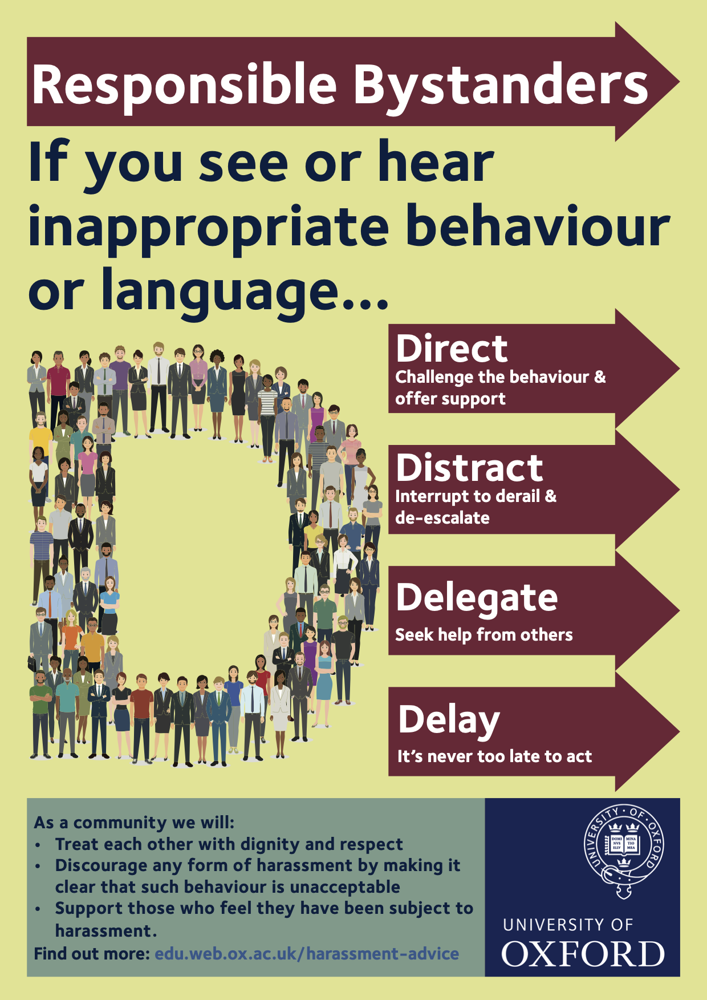

# Participation Guidelines
{: .fs-9 }

How Open WIN Community members are expected to work, communicate and interact with each other, so we can all perform at our best.
{: .fs-6 .fw-300 }

---

## Guiding principles
We value the participation of every member of our community and want to ensure that every contributor has an enjoyable and fulfilling experience.

Accordingly, everyone who participates in the Open WIN Community is expected to show respect and courtesy to other community members at all times.

Cassandra Gould van Praag, as [Community Engagement Coordinator](https://cassgvp.github.io/WIN-Open-Neuroimaging-Community/docs/community/community-who.html#community-coordinator---cassandra-gould-van-praag-sheher) of this project, and all project members, are dedicated to a ***harassment-free experience for everyone***, regardless of gender, gender identity and expression, sexual orientation, disability, physical appearance, body size, race, age, religion or technology choices. **We do not tolerate harassment by and/or of members of our community in any form**.

## Traditionally under-represented groups
We are particularly motivated to support new and/or anxious contributors, people who are looking to learn and develop their skills, and anyone who has experienced discrimination in the past.

We invite all members of this community to actively support the participation of under-represented individuals through recognition of our own privilege and consideration of [how we can use our privilege to benefit others](https://www.ucl.ac.uk/chemical-engineering/edi/better-allies/understand-your-privilege-and-use-it-good). 

"how some people have difficulties and as a community we can help each other. For example, people with reading issues or dyslexia may struggle with spelling"  

We work closely with the [WIN Member Networks](https://www.win.ox.ac.uk/about/edi/member-networks) to ensure that the behaviours we model and the materials we produce are aligned with best practice in establishing equality, diversity and belonging.

## Formal policy
This community is designed to serve individuals affiliated with WIN, and as such these individuals will all be expected to comply with [University of Oxford Harassment Policy](https://edu.admin.ox.ac.uk/harassment-policy) and the reporting procedures detailed in that policy.

We will begin events with a reminder of the Harassment Policy and expected behaviours. Anyone who experiences or witnesses a violation of the Harassment Policy is encouraged to address the incident directly where they feel safe to do so, or follow the reporting guidelines to escalate where necessary.

**Advice on how this policy is implemented and where you can receive support in these matters is available from the [University Equality and Diversity Unit](https://edu.web.ox.ac.uk/harassment-advice)**

## Being a responsible bystander
In this community we value efforts to promote a positive work environment, free from intimidation and all forms of violence. We are therefore pleased to support the University in enacting the Harassment Policy by acting as responsible bystanders, and doing what we can to promote a safe and conducive work environment. We encourage all community members to be responsible bystanders.

