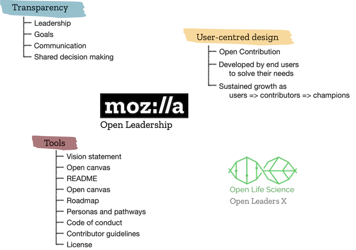
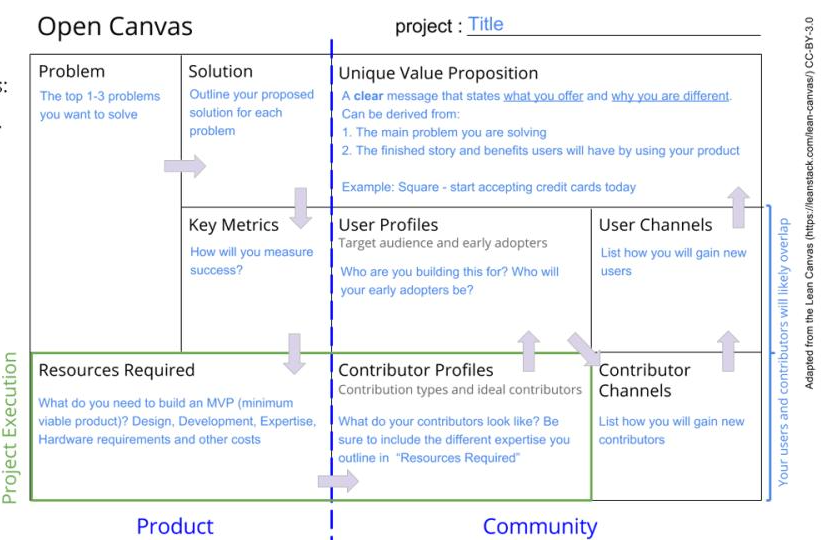
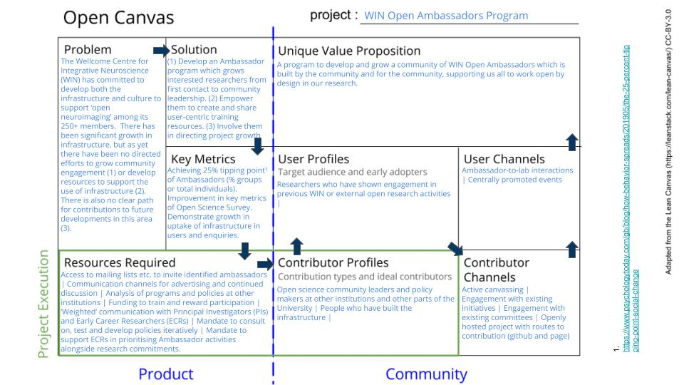

# What are our guiding principles of "Open Leadership" and why are they relevant to this community?
{: .fs-9 }

Find out about the principles guiding this project
{: .fs-6 .fw-300 }

---

This project is being developed with the guiding principle of "Open Leadership". The Open Leadership framework was developed by Mozilla to support open source community projects. It describes a set of tools and practices which have been used in creating this repository along with exercises which have helped design effective paths to contribution. These principles were passed to the Open WIN Community Coordinator through participation in the [Open Life Science](https://openlifesci.org) program.

# Mozilla Open Leadership Framework

The Mozilla Open Leadership Framework promotes open and inclusive participation, understanding, and sharing by design. This model has been refined through six years of training to prepare "open" (often open source) projects to be launched into the public arena.

The aim of this framework is to mobilise the community, solve shared problems and achieve shared goals. This is achieved by sharing a commitment to transparency - so all goals and motivations are clear - and inclusivity - so everyone can contribute - both in the leadership and contributors to the project.

An added benefits of this open model is that it forces the project to be very clear and considered about its goals, vision and strategy, so it can be communicated openly and effectively. It also crystallises a "user centric" perspective, by integrating the target audience into the development process. This means when the project is launched, it is ready to be picked up by advocates to support and champion the project to achieve maximum impact.

## Tools for engaging and growing the community
The open ethos is supported by a series of practices and tools for planning, project management, mentorship, growing a community and running events. We have used these tools to develop our vision for the Open WIN Community.

**Below we describe the tools and how they have been applied for this project. From each section we link to the full document in this repository. Jump to a specific section or read through them all!**

We welcome you feedback on every aspect, and will update these documents as the project progresses.

* [Vision statement](#vision-statement)
* [Open Canvas](#open-canvas)
* [README landing page](#readme-landing-page)
* [Project Roadmap](#project-roadmap)
* [Personas and pathways](#personas-and-pathways)
* [Code of conduct](#code-of-conduct)
* [Contributor guidelines](#contributor-guidelines)
* [License and citing the repository](#license-and-citing-the-repository)
* [Publish your project openly](#publish-your-project-openly)

### Vision statement

The Open WIN Community will build a community of researchers who are empowered to develop the training, policies, governance and structures we would like in place to support us in practicing open science.

We are working open as this is an effective way to develop a user focused and inclusive project which all members of our community can contribute to and benefit from.  

### Open Canvas

The open canvas is designed to help define project goals, strategy and resource needs to create a minimum viable product (MVP). The images below describe the sections for the open canvas and the model we have drafted for the future [Open WIN Ambassadors](ambassadors.md) program.

<!--  -->

<!--  -->

### README landing page

A project README is your welcome mat. It should set the tone for the project, clearly describe the motivations and orient potential contributors.

The README for the Open WIN Community is the [home page of this repository](../index.md).

### Project Roadmap

The roadmap outlines the plan for work ahead and should be shared openly with potential contributors. It summarises your vision and timeline for tasks. It is shared so people can see your progress along with the path you intend to travel. Openness here fosters trust and demonstrates an intention to involve your community in your activities.

Take a look at our [roadmap for the community](community/roadmap.md).

### Personas and pathways

This exercise helps you think about the different people who will engage with the project, how they will find you, and how you will help to develop them into sustained contributors and future leaders of the project.

Take a look at our [personas and pathways analysis for the community](community/personas-and-pathways.md).

### Code of conduct

This sets out how we will interact with each other when working on this project, and how we will report and take appropriate actions against violations of this code of conduct

Take a look at our [participation guidelines](community/CODE_OF_CONDUCT.md) and how we will support enacting University wide policies on harassment

### Contributor guidelines

This describes how you can engage with the project, both as a one-time contributor or sustained participant.

Take a look at our [contributing guidelines](CONTRIBUTING.md).

### License and citing the repository

We would love for others to use, share and reference this repository and the materials contained within. We have applied a CC-BY 4.0 licence  so you can share and adapt the materials here as long as attribution is given to this project.

Take a look at our [license and citation guidelines](LICENSE.md).

### Publish your project openly

Share and advertise your project so others can find it! Minimise all barriers to access. This repository showcases your objectives and ambition - be proud of it even (especially!) when it is unfinished.
