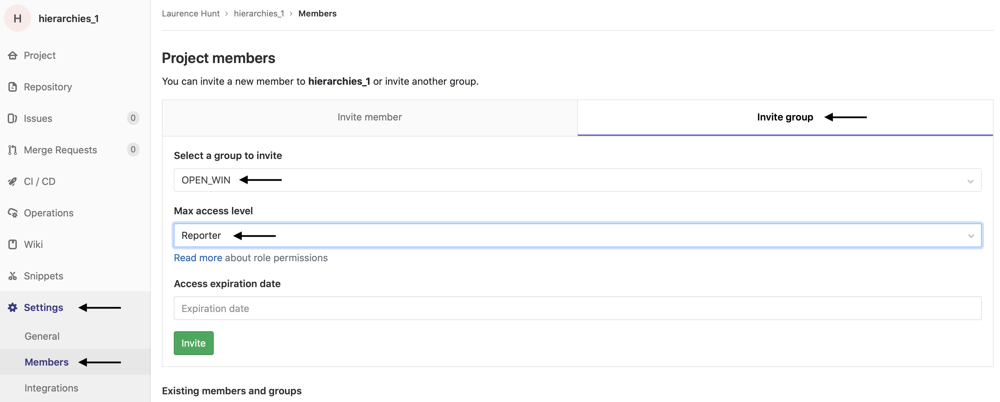

# Open Tasks
{: .fs-9 }

How to share your experimental tasks
{: .fs-6 .fw-300 }

---

## Purpose
The Open Tasks working group aims to encourage and incentivise researchers designing experimental tasks for functional neuroimaging to share these tasks openly with other researchers. They have established online repository for these paradigms to be shared, alongside documentation and analysis scripts for behavioural results. This working group also aims to train new members of the centre in open-source coding languages for paradigm development, and sharing reproducible environments.

 

      

## For WIN members
#### Version control 
The [WIN Open Tasks repository](https://git.fmrib.ox.ac.uk/open-science) is maintained in the WIN GitLab server. WIN members are invited to deposit their task code and materials when they are using a stable version, by cloning from their own GitLab or GitHub repository.  This implies that WIN members will be using a git process when developing their task, and as such their development journey will be version controlled.

#### Citable research output 
Versions of task materials can be assigned a digital object identified (DOI) using [Zenodo](https://zenodo.org) by uploading individual task repositories from GitLab. Once a DOI has been created, your task material becomes a citable object which you can add to your list of research outputs.

#### Reproducible methods detail 
WIN members will be supported in developing the necessary and sufficient documentation and running environments to enable others to launch, maintain and adapting their tasks. This facilitates effective re-use and modification of tasks within a research group, and with external collaborators.

## For external researchers
External users will be able to search the repository for experimental tasks which individual research teams have chosen to make openly available. Searches may be conducted using keyword terms based on the author, theoretical application, or stimulus type. Task materials may be deposited to support publications as supplementary methods material, or they may form the main body of research in new task development.

## How to use
### How do I access the WIN Open Tasks repository?
Access the Open Tasks repository via the [WIN Open Science GitLab group](https://git.fmrib.ox.ac.uk/open-science). To contribute a task to this repository, you will need to be added as a member - please contact [Laurence Hunt](https://www.win.ox.ac.uk/people/laurence-hunt) or [Cassandra Gould van Praag](https://www.win.ox.ac.uk/people/cassandra-gould-van-praag) to request permission.

### What software package should I use?
If you're starting out with developing a new task, we recommend using [PsychoPy](https://www.psychopy.org/). There are several advantages to PsychoPy over other potential platforms. It contains both a *builder* mode (for people want to use a GUI to build their experiment) and a *coder* mode (for people who want to be as flexible as possible) - and the builder automatically creates usable Python code that you can edit in coder mode, which is a great way to learn. It has good, reliable *timing*, that has been tested across platforms. It can run experiments *online* or in the lab, and has its own server ([Pavlovia](https://pavlovia.org)) where you can easily collect behavioural data online. And it has excellent documentation and a large and growing userbase.

Of course, there are several other options out there for designing your task, including [Psychtoolbox](http://psychtoolbox.org/), [Presentation](https://www.neurobs.com/), [Gorilla](https://gorilla.sc/), and [Unity](https://unity.com). If you develop your task using one of these platforms, you are still very welcome to share your task via the WIN Open Tasks repository!

### Where should I go to get advice on running experiments online?
We recommend looking at this [Introduction to Online Experiments](https://online-ws.readthedocs.io/en/latest/), developed by the Brain and Cognition lab. These are strongly tailored towards people who are based at the University of Oxford and trying to develop their tasks, and includes guidance on programming your study, hosting it, recruiting participants, collecting data and obtaining ethical approval.

### I currently use the PsychoPy/Pavlovia ecosystem. Is there a way to share my tasks there?
Yes! We think the [Pavlovia](https://pavlovia.org) system for task sharing is a great infrastructure for maintaining up-to-date versions of your tasks, and sharing them with the rest of the world. As you may be aware, the back-end of the Pavlovia system is managed by GitLab, which can be accessed [here](https://gitlab.pavlovia.org). At WIN, we have a group called [OPEN_WIN](https://gitlab.pavlovia.org/open_win) where we are gathering together projects that people are working on within Pavlovia. To contribute a task to this repository, you will need to be added as a member - please contact [Laurence Hunt](https://www.win.ox.ac.uk/people/laurence-hunt) or [Dejan Draschkow](https://www.psych.ox.ac.uk/team/dejan-draschkow) to request permission.

### How do I add my task to the WIN Open Tasks repository and/or to the OPEN_WIN Pavlovia repository?
Once you've been added as a member of the WIN Open Tasks reposistory and/or the OPEN_WIN Pavlovia repository (see above), you can add your repositories to these groups! In WIN GitLab, go to your repository, and then click on "Members", then "Invite Group", and choose "open-science" in your group to invite. In PsychoPy, go to [Pavlovia GitLab](https://gitlab.pavlovia.org/), and then click on "Settings", "Members", "Invite Group", and choose "OPEN_WIN" as the group. We recommend that you add the repository to the group with 'reporter' permissions. See below for an example of how to do this:

### Who should I ask for further advice about sharing my tasks?
In first instance, feel free to email [Laurence Hunt](https://www.win.ox.ac.uk/people/laurence-hunt) for any further information you need.

## Working group members
We are grateful to the following WIN members for their contributions to developing the Open Acquisition database
- [Dejan Draschkow](https://www.psych.ox.ac.uk/team/dejan-draschkow)
- [Irene Echeverria Altuna](https://www.psy.ox.ac.uk/team/irene-echeverria-altuna)
- [Amy Gillespie](https://www.psych.ox.ac.uk/team/amy-gillespie)
- [Cassandra Gould van Praag](https://www.win.ox.ac.uk/people/cassandra-gould-van-praag)
- [Cameron Hassall](https://www.cameronhassall.com/)
- [Laurence Hunt](https://www.win.ox.ac.uk/people/laurence-hunt)
- [Paula Kaanders](https://uk.linkedin.com/in/paulakaanders)
- [Verena Sarrazin](https://www.psych.ox.ac.uk/team/verena-sarrazin)
- [Suyi Zhang](http://www.seymourlab.com/people/suyi-zhang.html)
